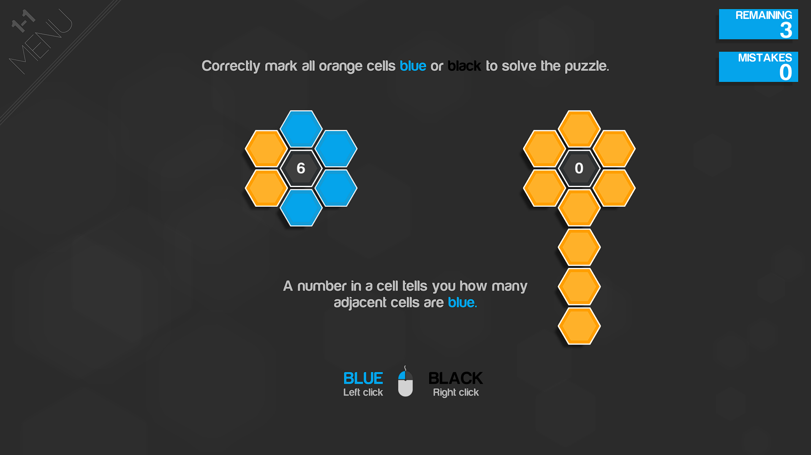
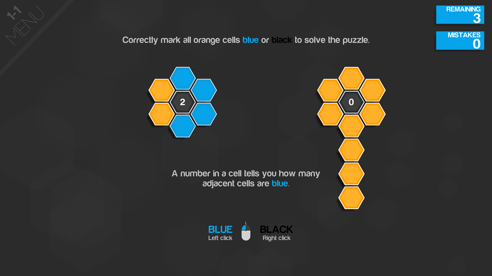

# Hexmod

**Hexmod** is a QOL mod for the **Hexcells trilogy**: [Hexcells](https://store.steampowered.com/app/265890/Hexcells/), [Hexcells Plus](https://store.steampowered.com/app/271900/Hexcells_Plus/) and [Hexcells Infinite](https://store.steampowered.com/app/304410/Hexcells_Infinite/).

The motivation for making this mod is as follows: the reason I prefer the similar game [Tametsi](https://store.steampowered.com/app/709920/Tametsi/) over the Hexcells games is because Tametsi has some very nice QOL features. Most importantly, when a mine (Hexcells equivalent is blue cells) is discovered, the hints relevant to that mine count down. For example, if you have a line indicating that 3 of the tiles touching that line have a mine, then every time you find a mine in that line, the line's number decrements (and similarly for tile numbers indicating how many of the tile's neighbors are mines). In other words: hints indicate *unfound* mines, rather than the total number of mines.

This is extremely convenient because it cuts down on the tedious and menial mental work of counting how many mines you have left to discover in a region/line. It makes the game faster and more convenient to play without directly increasing the puzzle's difficulty. Hexmod ports this exact feature to the Hexcells trilogy, and it supports all of the trilogy's hints: hints on black tiles, hints on columns, and hints on blue flowers. The mod is also compatible with resuming levels from a save, and levels where some cells are marked blue at the beginning. It is also compatible with all 3 types of levels in Hexcells Infinite; base game levels, custom levels and generated levels.

So, when you're playing 6-5 in Hexcells Infinite, don't worry about squinting at the screen to see how many blue cells are undiscovered on that long diagonal line; the line's number now tells you itself!

# Demonstration

Vanilla game:

Hexmod:

# How to install

**The installation progress is the same for each Hexcells game**. [Download the Hexmod.zip file](https://github.com/Shining-Concepts/HexMod/raw/main/Hexmod.zip). Extract the contents inside it to the install directory for your Hexcells game. So this means that the contents of the .zip ("doorstop_config.ini", "winhttp.dll" and a folder called "BepInEx") should all be in the same location as the .exe file for the Hexcells game. Then just launch the game and the mod should be working.

To delete this mod, simply delete those 2 files from the .zip and the "BepInEx" folder. You can also disable the mod temporarily by editing the doorstop_config.ini file, and changing `enabled=true` to `enabled=false` (and then back again to re-enable the mod).

# Thanks

In no particular order, I would like to thank:

* Matthew Brown for making these amazing puzzle games. (And for making them all use the same codebase, that was VERY helpful when developing!)

* Grip Top Games for making Tametsi which inspired this mod.

* The developers of the [BepInEx](https://github.com/BepInEx/BepInEx), [UnityInspector](https://github.com/Mohelm97/UnityInspector) and [dnSpy](https://github.com/dnSpy/dnSpy) programs. BepInEx was the framework for developing this mod, dnSpy helped me view the game's assembly code, and UnityInspector helped me inspect the game as it ran to gain useful information to inform my coding (without it, I would've had to give up at several points).

* Abbysssal on Steam for writing [this guide](https://steamcommunity.com/sharedfiles/filedetails/?id=2106187116) which was extremely helpful and the foundation of my coding approach. Though the guide was specifically for Streets of Rogue I found it was great for learning BepInEx in general.

# How to Build

The first 3 steps of the linked Abbysssal Steam guide should get you started. The specific Visual Studio references I needed to add to the project were 0Harmony.dll and BepInEx.dll from "BepInEx/Core" when you download BepInEx, as well as Assembly-CSharp.dll and UnityEngine.dll from "Hexcells\Hexcells_Data\Managed".

Afterwards, you can Build your solution. Protip: configure VS so that it automatically builds your solution to the "BepInEx/plugins" folder, as that folder is where your BepInEx mod will be stored. This will save you the time of manually copying and pasting the files every time you update the build.

# Known Bugs

There are two known bugs I am aware of with this mod that I have not been able to fix. Neither of them are too serious.

* **Rare graphical glitch**: In each of levels 2-3 and 5-3 of the first Hexcells game (I never saw this issue elsewhere, not sure if it could appear in custom levels), there's exactly one black tile that appears to be duplicated in the same location and displays the same number. This isn't a problem in the vanilla game (since the hint numbers never count down and thus you won't notice), but Hexmod seems to only be able to update the hint text for one of those black tiles; and thus, you will see *both* the updated hint text from the Hexmod-affected tile, and the original hint text from the Hexmod-unaffected tile, in the same location. [Here is how the glitch appears in 2-2](https://i.imgur.com/1BjFvrj.png); you can see that the updated hint text of 0 is there, but the duplicated original tile still shows 2 at the same location. This shouldn't be too big a deal, these levels aren't that hard and you can probably make out what the updated hint text is.

* **Hexcells Infinite save loading glitch and workaround**: The Hexcells trilogy supports save states; if you exit a level while it is partially done, the game will save your progress and you can resume where you left off. With Hexmod, in and only in Hexcells Infinite (for reasons I'm clueless on this issue isn't in the first game/Hexcells Plus), this is slightly bugged. While loading levels from the same session is fine (if you exit a level and return to it before you exit the game no problem); when you make progress on a level, exit the game, launch it later, and attempt to enter that level: the level will be restarted and your progress not there. Inexplicably but thankfully, this can be easily fixed: if you exit the level before making any further progress, and then re-enter it, your progress from your previous session will be successfully loaded. So in summary: if you find that your save progress is lost for a level in Hexcells Infinite, simply exit the level before doing anything, and then re-enter the level, and your progress is hopefully now there.

# Troubleshooting / Contact Info

If you encounter any errors or unexpected behavior with this mod (aside those listed above), please let me know. You can reach out to me via email at reddit.shiningconcepts@gmail.com or directly on Reddit at /u/ShiningConcepts. Please detail what error you're having and steps to reproduce it.

Also, if you have any questions about this mod, or if you enjoyed using the mod, I more than welcome you to contact me to let me know :).